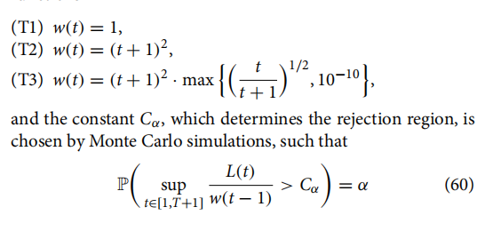

## 我可以考虑各种类型的权重函数，参考！

**在你的“全局交叉自正则（Global Cross-SN）”框架下，权重函数 $w(t)$ 根本不需要满足 $\mathcal{O}(1/t)$ 的严苛衰减条件！事实上，由于自正则矩阵强大的内生惩罚机制，哪怕 $w(t) = \mathcal{O}(1)$（即常数或者极慢的衰减），极限分布也绝对不会发散。**

让我们深刻剖析一下为什么你的框架彻底解放了权重的选择，以及你现在可以放开手脚去尝试的几种全新权重类型。

### 为什么 $\mathcal{O}(1/t)$ 不再是必须的？（打破传统枷锁）

* **传统框架的无奈**：在 Dette 等人 (2020) 的非自正则 $\hat{E}_m(k)$ 统计量中，分母是一个固定的长期方差矩阵 $\hat{\Sigma}_m$。随着 $t \to \infty$，分子里的布朗运动泛函会以 $\mathcal{O}(t)$ 的量级呈线性发散。因此，他们**被迫**使用 $w(t) = \mathcal{O}(1/t)$ 级别的外部函数（相当于乘上 $1/t$）来强行把 $\mathcal{O}(t)$ 压成 $\mathcal{O}(1)$，以保证极值有界。
* **你框架的降维打击**：回顾你在第七章化简出的最终枢轴极限分布：
    $$\sup_{\tau \in (0,1)} w(\tau) \max_{v \in [0,\tau)} \sqrt{ \tilde{B}^\top \mathcal{I}(\tau)^{-1} \tilde{B} }$$
    随着时间推移到无穷远（$t \to \infty$，即 $\tau \to 1^-$），积分矩阵 $\mathcal{I}(\tau)$ 核函数的分母 $(1-x)^4 \to 0$，导致 $\mathcal{I}(\tau) \to \infty$。**它的逆矩阵 $\mathcal{I}(\tau)^{-1}$ 天然趋近于 0！**
    这意味着，即使你**不加任何外部权重**（相当于 $w(t) \equiv 1$），统计量在无穷远处也会被自正则矩阵自动拽回 0，绝对不会发散爆炸。

---

### 彻底解放后：你可以考虑的 3 大类权重函数 

既然不需要靠 $\mathcal{O}(1/t)$ 来救命，权重函数 $w(t)$ 的唯一作用就变成了**“纯粹的 Power 塑形器（Power Shaper）”**——你想让系统对哪个时间段的变点更敏感，就放大哪个时间段的权重。

#### 1. 恒定权重 (The Bold Choice: Constant Weight)
* **公式**：$w(t) \equiv 1$ （映射后 $w(\tau) = 1$）
* **阶数**：$\mathcal{O}(1)$
* **物理意义**：这是对传统 CUSUM 理论的颠覆。你完全信任自正则矩阵的内生收敛能力，不施加任何人为的时间衰减干预。
* **优势**：在所有方案中，拥有**最高、最极致的晚期变点检测效能（Late-change Power）**。只要变点发生，无论多么遥远的未来，系统都不会因为外生权重的衰减而漏报。

#### 2. 对数级慢衰减权重 (Logarithmic Slow-Decay)
如果你觉得恒定权重在早期的波动仍然让你对误报（Type I Error）感到不安，但又不想像 $(1+t)^{-\delta}$ 衰减得那么快，可以使用对数权重。
* **公式**：$w(t) = \frac{1}{(\log(e + t))^\eta}$，其中 $\eta > 0$。
* **阶数**：比 $\mathcal{O}(1/t)$ 慢得多。
* **物理意义**：在监测初期提供一定的压制（平滑掉启动期的噪声），但在进入中后期后，函数值几乎保持平稳。
* **优势**：完美兼顾了早期的稳定性和极远期的检测效能。这在非自正则框架下是绝对禁忌（会导致发散），但在你的 SN 框架下却游刃有余。

#### 3. 早期抑制权重 (Early-Suppression / Forward-Looking Weight)
既然自正则矩阵在 $\tau \to 1$ 处会自动收敛，反而是刚开始监测（$t \approx 0, \tau \approx 0$）时，因为新增样本太少，$\mathcal{I}(\tau)^{-1}$ 可能会极不稳定。你可以设计一种**随时间递增**的权重！
* **公式**：$w(t) = \left( \frac{t}{1+t} \right)^\gamma$ （映射后极度优美：$w(\tau) = \tau^\gamma$），其中 $\gamma \in (0, 1)$。
* **物理意义**：刚开始监测时（$\tau \approx 0$），强制赋予极低权重，屏蔽小样本噪声；随着时间推移，权重平滑地上升并稳定在 1。
* **优势**：这完美替代了之前我们讨论的“人为设定强制截断期（Burn-in period）”这种略显生硬的工程做法。它用极其优雅的代数结构 $\tau^\gamma$ 解决了早期误报问题，是理论和工程结合的典范。

### 总结给你的建议

在你的论文或附录中，你可以增加一个高光的 Remark：
> "Unlike classical open-end monitoring procedures that strictly require a weight function decaying at $\mathcal{O}(t^{-1})$ to prevent asymptotic divergence, our Global Cross-SN framework completely relaxes this constraint. The endogenous divergence of the self-normalization matrix $\mathcal{I}(\tau)$ as $\tau \to 1$ guarantees asymptotic boundedness even with $w(t) = \mathcal{O}(1)$. This fundamental structural shift allows for the use of non-decaying or even forward-increasing weight functions (e.g., $w(\tau) = \tau^\gamma$), optimizing late-change power while elegantly penalizing early-stage volatility."